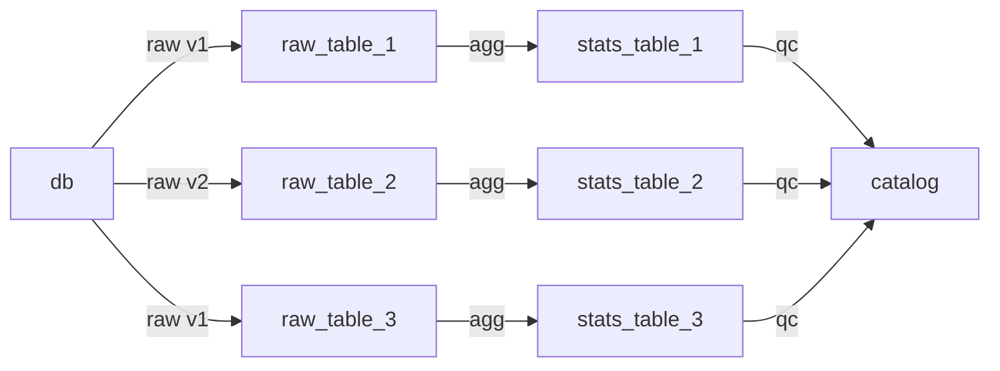

# Implementing a small data observability framework

Data observability can mean a lot of different things depending on how you look at the problem. In general, it refers to the process of consistently monitoring the quality and reliability of a data producer, but it could also mean looking at the performance of the pipeline generating the data itself.

This post walks through a small, homemade framework my team built to do exactly that: every table we produce automatically gets a statistics file computed on top of it, and a set of assertions runs against those statistics before the data is allowed to move downstream. It's a simple pattern, but it gave us quality gates and free observability of datasets.

## The three building blocks

The framework is built around three concepts, each defined as a templated Python class:

- **`raw`** — a curated dataset produced by a Spark job. Think of it as a snapshot of our current knowledge, extracted from a source like S3 files or a live database.
- **`stats`** — a small JSON file of aggregated metrics (row counts, unique keys, group-by counts, etc.) computed for each `raw` table on every run.
- **`qc`** — a list of assertions that run against the `stats` file. If the assertions pass, the table is promoted to the next step; in our case, a data catalog.

In terms of flow, a complete DAG would look like the following:



To put it simply, we compute a simple `agg` file containing some derived metric for each table, and use the derived metric computed inside `agg` to assert whether the data is going to the next step (in our case it would be a data catalog).

## Step 1: The raw framework

One of my tasks at some point in my career was to come up with a platform that would enable our team to create spark scripts using some templated python framework. We would define output tables using Python, defining input and output tests, schema and the spark processing logic, and plug these output tables to a given data source (s3 files, running DB etc.). The framework would then automatically create the tests for the spark logic, generate documentation and deploy the spark script with CI/CD. In our architecture, this framework would be use to create "raw" curated datasets, which are more or less snapshots of our current knowledge. Let's call this framework `raw`. The definition of a new table would look like this:

```python
class FoobarTable(BaseTable):

    @property
    def table_id(self) -> str:
        return "foobar"

    @property
    def primary_key(self) -> str:
        return "id"

    def input_columns(self) -> list[str]:
        return ["id", "name"]

    def input_example(self) -> list[dict]:
        return [{"id": "123123", "name": "John Doe"}]

    def output_example(self) -> list[list]:
        return [["123123", "John Doe"]]

    def schema(self) -> StructType:
        # Schema for {"id": str, "name": str}
        return FoobarSparkSchema

    def extract(self, sources: list[Source]) -> DataFrame:
        source = sources[0]
        df = source.get_df().select(self.input_columns())
        # Do some transformations
        return df
```

This Python framework was deployed and working for some time, and the next thing that we wanted to do in the team is to make sure that the quality is there. To the next step.

## Step 2: The stats framework

To meet these requirements, we decided to create a second centralized python framework to define templated aggregations and quality checks on top of each `raw` table that we generated. The aggregation step (`stats`) would be defined using a templated class, by specifying what aggregation to compute on which column using pre-established common operators, or otherwise writing ad-hoc spark aggregations.

```python
class FoobarStats(BaseStats):
    table = RawTable(
        table_id="foobar",
        primary_key="id",
    )
    # Compute a simple group by name
    group_by_count_fields = ["name"]
```

This would then output a json file looking like:

```json
{
  "table_id": "foobar",
  "context": "prd",
  "date": "2020-01-01",
  "size_bytes": 1231908,
  "number_rows": 500000,
  "unique_id": 2,
  "group_by_count": {
    "name": { "John Doe": 300000, "Jane Smith": 200000 }
  }
}
```

The `qc` step would also be defined using a templated class, but this time specifying a list of assertions to run against the previously computed `stats` object.

## Step 3: The QC framework

The last step is then to define a simple quality check to run against that stats file:

```python
class FoobarQC(BaseQC):
    table_id = "foobar"
    assertions = [
        Assertion(
            source="unique_id",
            comparison="greater_than",
            target=300_000,
        ),
    ]
```

## Deployment considerations

Every table needs its own aggregation and quality check collection. Without a solid template system, this becomes a lot of code and a pain to redeploy when all you want is to add one extra aggregation to one table.

We handled this with two different versioning strategies:

- The **`raw` framework is versioned and frozen**: every DAG pins a specific version, because the processing logic directly shapes the data our downstream processes consume.
- The **`stats` and `qc` frameworks follow a simpler `dev`/`main` branch model**: each DAG references one of the two branches directly. Since these metrics are only used for internal quality purposes, a floating version is an acceptable trade-off, and it makes redeployment much quicker and easier.

## Benefits of systematic aggregations

Beyond the quality gates themselves, consistently computing statistics for every table gives you instant visibility. Load the `stats` files for a table over a period of time and you can immediately plot, say, the number of rows per day. That can be a dashboard, a databricks notebook or through an API.

It's also a powerful debugging tool. Database writes can fail silently over a period of time, or quietly insert malformed records or metadata. With the `stats` files, you can monitor how many new documents land in the database each day, or watch how specific metrics evolve over time, and pinpoint when things started going wrong.

## Wrapping up

With three small templated classes – `raw` for the data, `stats` for the metrics, `qc` for the assertions – we got systematic quality checks on every table plus a free time series of metrics for monitoring.

The main limitation is that assertion-based checks only catch what you thought to measure: a metric you never aggregated can be a failure you'll never detect. A natural next step would be anomaly detection on the `stats` time-serie itself using anomaly detection algorithms – or comparing this homemade approach against other tools like Great Expectations.

But as a starting point, this is a surprisingly effective way to observe your data.
