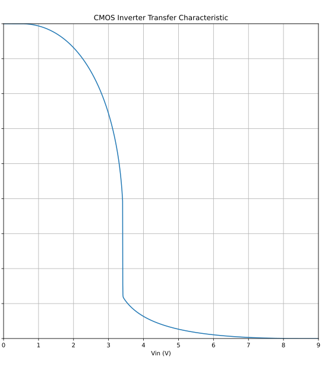

I have been playing bass guitar for around a decade. I developed this condition called GAS – Gear Acquisition Syndrome, quite common for musicians. At some point, it becomes easier to pay for new gear and feel the consumption thrill, than to sit down and practise. That's how I acquired my favourite bass pedal overdrive pedal, the Darkglass Vintage Microtubes, a CMOS-based overdrive ! It's a very iconic bass pedal that recreates the feeling of an overdriven vintage amp. It's been on my pedalboard ever since as my always on pedal.

## The problem

Analog devices are nice, but they also require space and money. For most of my practice sessions, I actually found myself plugging my bass directly into my sound card, and using a software to emulate the amp sound. It was the most convenient way for me to practice, plug the guitar, open the software and practice.

I bought a software to do the amp emulation on my laptop, one emulating my favorite pedal : the Darkglass Ultra from NeuralDSP. For some reason, I never really settled with it. The sound was not as organic as my analog pedal, and I wanted to be able to do some more things like adding compression and chorus onto the signal. At the same time, I didn't want to open a DAW (Digital Audio Workstation) to add extra plugins. I liked the idea of using a single software for my practice session. That's how I decided to code my own software, that would bundle together the amp emulation, the compression and the chorus effects.

## Coding an audio software

The most well known open-source framework for coding such softwares is called Juce and uses C++. I had learnt C++ during my studies, so nothing too hard to setup. I won't dive into the details, but setting up an audio application is actually straightforward, and some boilerplate was actually enabling me to create a software to directly stream the sound from my soundcard into my headphones. Now, I needed to write the actual algorithm to transform the audio buffer coming from the input into a processed signal. For the compressor and chorus effects, I used standards algorithms and adjusted them to my taste, but I did nothing fancy on this part. For the overdrive part that's another story, but I'll try to explain.

## Overdrive and waveshapers

The very first overdriven tones were, like most interesting discoveries, accidental. Amplifier tubes would malfunction — through age, rough handling, or simply being pushed past what they were designed to handle — causing the signal to clip: the peaks of the sound wave would flatten, and in doing so, produce something harmonically richer and more interesting than the original. Early blues and rock & roll players noticed this, recognized it for what it was worth, and began reproducing it deliberately. The rest, as they say, followed.
At the technical core of any overdrive or saturation effect sits a waveshaper — a function that takes an input amplitude and returns an output amplitude, but not in a straight line. The most commonly used is the hyperbolic tangent:

$$w(x) = \tanh(kx)$$

where $k$ controls the drive amount. At low drive, the curve is nearly linear and the effect is subtle; as $k$ increases, the output begins to saturate and harmonics emerge. It is a simple function, which is part of why it works so well.

Any function $w$ will do, in principle – the shape of the curve is what determines which new harmonics get introduced into the signal. For overdrive and saturation specifically, the waveshaper flattens the peaks of the input down to a capped value. This produces a generous amount of new harmonics and a natural compression of the sound.


## Modeling the Vintage Microtubes signal chain

To model my Vintage Microtubes pedal digitally, I did what any reasonable person would do: study how the real hardware actually works, rather than guessing, which tends to produce mediocre results.

As it turns out, other enthusiasts had already taken the trouble of sharing detailed circuit diagrams on various forums. This is one thing the internet facilitates, and it saved me a considerable amount of time.

These diagrams reveal exactly what happens to your audio signal as it moves through the pedal. It passes through a series of filters — components that selectively boost or cut certain frequency ranges — before and after reaching the core distortion stage. Filters are the pedal's tone-shaping components. Some cut low frequencies. Some cut highs. One carves a very specific notch out of the spectrum, which turns out to matter quite a bit for the overall character of the sound. The signal flow is not complicated and can be summarized as the following :

$$
\text{Input} \rightarrow \text{Filter}_1 \rightarrow \text{Filter}_2 \rightarrow ... \rightarrow \text{CMOS} \rightarrow \text{Filter}_N \rightarrow ... \rightarrow \text{Output}
$$

Recreating the filters digitally is the straightforward part. The circuit diagrams include the exact values of every resistor and capacitor, and from those numbers the filter behavior follows mathematically. The JUCE audio framework then handles the implementation cleanly — this is the kind of problem it was designed for.

The CMOS chip is a different matter, and the more interesting one. It is a small electronic component that, when driven beyond its intended operating range, produces distortion — the harmonic grit that defines the pedal's personality. Unlike the filters, which behave in an orderly, linear fashion, the CMOS distorts the signal in ways that resist simple mathematical description. Pinning down the precise function that captures this behavior — the so-called waveshaper function — is the real problem.

## The standard CMOS model

The transfer curve — or waveshaper function — can usually be found in the datasheet of the chip, in this case the CD4049. It does not come with a ready-to-use equation, so one needs to be derived.For modeling purposes, the Shichman-Hodges model is commonly used, based on a square law approximation. A CMOS device consists of two transistors, an NMOS and a PMOS, each conducting over different input voltage ranges. The model yields piecewise functions over distinct operating zones. In both transistors, the current $I_{DS}$ controlled by two voltages: $V_{GS}$ the voltage between gate and source which controls whether the transistor conducts, and $V_{DS}$, the voltage between drain and source across which the current flows. Each transistor has a threshold $V_{th}$. For clarity, we use the conventions $nmos=n$ and $pmos=p$.

$$
I_{DS,n} = \begin{cases}
0 & (V_{GS} \leq V_{th,n}) \\
k_n \left[ (V_{GS} - V_{th,n}) V_{DS} - \dfrac{V_{DS}^2}{2} \right] & (V_{GS} > V_{th,n},\ V_{DS} < V_{GS} - V_{th,n}) \\
\dfrac{k_n}{2} (V_{GS} - V_{th,n})^2 (1 + \delta \cdot V_{DS}) & (V_{GS} > V_{th,n},\ V_{DS} \geq V_{GS} - V_{th,n})
\end{cases}
$$

$$
I_{DS,p} = \begin{cases}
0 & (V_{GS} \geq V_{th,p}) \\
-k_p \left[ (V_{GS} - V_{th,p}) V_{DS} - \dfrac{V_{DS}^2}{2} \right] & (V_{GS} < V_{th,p},\ V_{DS} \geq V_{GS} - V_{th,p}) \\
-\dfrac{k_p}{2} (V_{GS} - V_{th,p})^2 (1 + \delta \cdot V_{DS}) & (V_{GS} < V_{th,p},\ V_{DS} < V_{GS} - V_{th,p})
\end{cases}
$$

Each zone can be implemented directly in code. The output voltage $V_{out}$ then found by solving KCL at the output node, using a Newton-Raphson method with the conductances $G_{x} = dI_{x} / dV_{x}$ as the derivative term.

Here is what a solver with python could look like:

```python
class CMOS_SH:

    def __init__(self):
        self.V_dd = 9.0
        self.kn = 1.0e-3
        self.vth_n = 0.5
        self.kp = 0.4e-3
        self.vth_p = -0.5
        self.delta = 0.06

    def nmos(self, vgs, vds):
        vt = self.vth_n
        if vgs <= vt:
            return 0.0, 0.0
        if vds < vgs - vt:
            ids = self.kn * (vgs - vt - vds / 2) * vds
            gds = self.kn * (vgs - vt) - self.kn * vds
            return ids, gds
        ids = 0.5 * self.kn * (vgs - vt) ** 2 * (1 + self.delta * vds)
        gds = 0.5 * self.kn * (vgs - vt) ** 2 * self.delta
        return ids, gds

    def pmos(self, vgs, vds):
        vt = self.vth_p
        if vgs >= vt:
            return 0.0, 0.0
        if vds >= vgs - vt:
            ids = -self.kp * (vgs - vt - vds / 2) * vds
            gds = -self.kp * (vgs - vt) + self.kp * vds
            return ids, gds
        ids = -0.5 * self.kp * (vgs - vt) ** 2 * (1 + self.delta * vds)
        gds = -0.5 * self.kp * (vgs - vt) ** 2 * self.delta
        return ids, gds

    def solve(self, vin: float) -> float:
        vout = self.V_dd / 2
        for _ in range(10):
            vgs_n, vds_n = vin, vout
            vgs_p, vds_p = vin - self.V_dd, vout - self.V_dd
            ids_n, gds_n = self.nmos(vgs_n, vds_n)
            ids_p, gds_p = self.pmos(vgs_p, vds_p)

            f_x = ids_n + ids_p
            f_prime_x = gds_n + gds_p

            # Add a small dampening factor to ensure stability of the solving
            vout = vout - f_x / (f_prime_x + 1e-3)
            vout = np.clip(vout, 0, self.V_dd)
        return vout
```

By using the solver above, we can the compute the transfer curve. To use it into our DSP plugin, we generally rescale the curve to be centered around 0 with maximal values of 1 and -1, like our good friend $tanh$.




1. Naive physical model - not that well sounding
2. Mention the research paper
3. Explain the model being used
4. Explain how to compute the transfer curve
5. Explain how to use it inside the software
6. Et voilà
